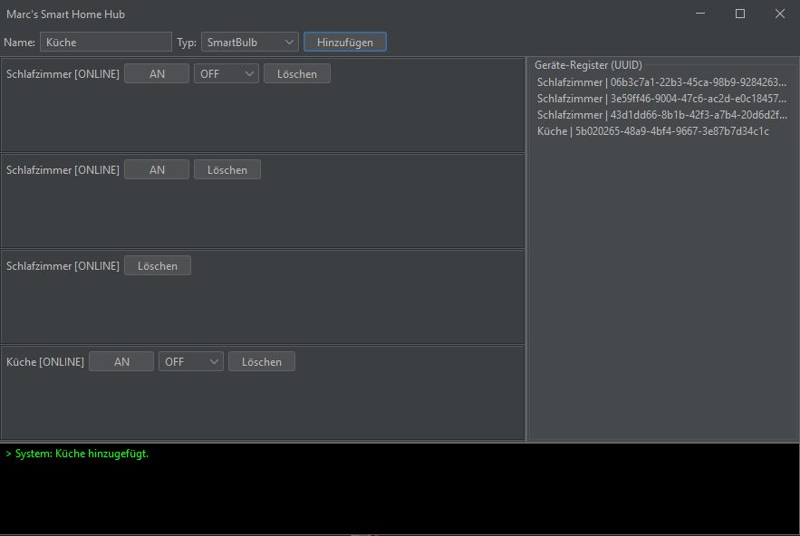

# 🏠 Smart Home Hub – Java Simulation

Eine robuste, objektorientierte Simulation einer Smart-Home-Zentrale, entwickelt mit Java und Swing. Dieses Projekt demonstriert die praktische Anwendung moderner Software-Architekturmuster und die Integration von grafischen Benutzeroberflächen.

## 🚀 Highlights
* **Dynamische Geräteverwaltung**: Hinzufügen, Steuern und Entfernen von Geräten in Echtzeit über ein Dashboard.
* **Persistente Datenspeicherung**: Automatische Serialisierung der Konfiguration in eine `config.json` beim Schließen oder Speichern – deine Geräte sind beim nächsten Start sofort wieder da.
* **Modernes UI/UX**: Einsatz des **FlatLaf** Look-and-Feel für ein zeitgemäßes Dark-Mode-Design und verbesserte Skalierung auf High-DPI Monitoren.

---

## 🏗️ Software-Architektur (OOP Konzepte)

Dieses Projekt wurde mit Fokus auf die **Säulen der objektorientierten Programmierung** entwickelt:

* **Abstraktion & Vererbung**: Eine zentrale Klasse `AbstractDevice` bildet das Fundament für alle Gerätetypen (Bulbs, Plugs, Sensoren).
* **Interfaces**: Funktionen wie `Switchable` (An/Aus), `Dimmable` (Helligkeitssteuerung) und `Sensor` (Daten abrufen) sind über Interfaces entkoppelt. Dies ermöglicht eine einfache Erweiterung um neue Hardware-Typen.
* **Polymorphie**: Der `Controller` verwaltet alle Geräte in einer einheitlichen Liste, führt aber je nach Objekttyp spezifische Logiken aus (z.B. Dimmen vs. Schalten).
* **Fehlerbehandlung**: Implementierung einer eigenen `DeviceOfflineException`, um Kommunikationsfehler im System abzufangen.

---

## 🛠️ Technische Details

* **Programmiersprache**: Java 17+
* **GUI-Framework**: Java Swing
* **Design-Bibliothek**: FlatLaf 3.4.1
* **Datenformat**: JSON (Manuelle Serialisierung für maximale Portabilität ohne externe JSON-Libraries)

---

## 🤖 Automatisierungs-Logik

Das System enthält bereits ein Grundgerüst für Automatisierungen (`AutomationRule`).
- **Trigger-Aktor-Prinzip**: Ein Sensor (z.B. `MotionSensor`) kann eine Aktion bei einem Aktor (z.B. `SmartBulb`) auslösen.
- **Sicherheit**: Die Regel prüft vor der Ausführung den Verbindungsstatus des Aktors und wirft ggf. eine `DeviceOfflineException`.

---

## Installation & Setup
1. Klone das Repository: `git clone https://github.com/Mstandfest/SmartHomeHub-Simulation`
2. Öffne den Ordner in **IntelliJ IDEA**.
3. Stelle sicher, dass die `libs/flatlaf-3.4.1.jar` als Library eingebunden ist.
4. Starte die Anwendung über die `Main.java`.

*Hinweis: Die Datei `config.json` wird automatisch im selben Ordner erstellt, sobald du dein erstes Gerät anlegst.*

---

## 📝 Bedienung
1.  **Gerät hinzufügen**: Name eingeben, Typ wählen und auf "Hinzufügen" klicken. (Simulation: Das Gerät durchläuft eine 5-sekündige Pairing-Phase).
2.  **Steuerung**: Nutze die Buttons zum Schalten oder den Schieberegler zum Dimmen der Lampen.
3.  **Entfernen**: Über den "Löschen"-Button wird das Gerät permanent aus der Liste und dem Speicher entfernt.
